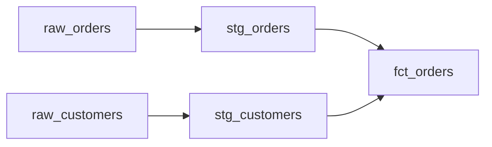

# Write Review Notebook

After completing dbt model work, create a SignalPilot notebook that proves the work was done correctly. The notebook is a living document — shareable via URL, queryable, and visual.

## When to Use

Run this skill after finishing dbt model development. The output is a notebook that a non-technical reviewer can open and understand what was built, why, and that it's correct.

## Step 1: Create the notebook file

Use the scaffold script to generate boilerplate:

```bash
python3 "${CLAUDE_SKILL_DIR}/create_notebook.py" notebooks/review.py --title "Model Review" --sp-init --cells 1
```

Or construct the file directly — see the Notebook Format section below.

## Step 2: Run via MCP

```
list_workspace_projects()  → get project_id
run_notebook(filename="notebooks/review.py", code="...", project_id="...")
```

Pass `agent_branch` back on subsequent calls to iterate.

## Step 3: What the review notebook must contain

Build the notebook with these sections. Each section is one or more `@app.cell` blocks.

### Section 1: Executive Summary
- One-paragraph description of what was built
- Count of models created/modified
- Connection and schema used
- Timestamp of the review

### Section 2: Model Inventory
- Table listing every model: name, materialization, row count, column count
- Use `sp.ui.table()` for interactive display
- Query each model with `SELECT count(*) FROM {model}`

### Section 3: Data Samples
- For each model, show `SELECT * FROM {model} LIMIT 5` in a table
- Highlight key columns the model was designed to produce
- Show column types and nullability

### Section 4: Lineage & Dependencies
- List source tables and how they connect to final models
- Show the JOIN logic used (which keys, which direction)
- Use `sp.md()` with Mermaid diagrams:
```python
sp.md("""

""")
```

### Section 5: Decision Log
- Every design decision with rationale:
  - Why this grain? (one row per order vs one row per line item)
  - Why these JOINs? (LEFT vs INNER, why)
  - Why these filters? (WHERE clauses explained)
  - What was excluded and why
  - What the YML said vs what the data showed (if they differed)
- Use `sp.callout("...", kind="info")` for decision callouts

### Section 6: Validation Results
- Row counts per model (expected vs actual)
- NULL audit: `SELECT column, count(*) FILTER (WHERE column IS NULL) FROM model`
- Duplicate check: `SELECT key, count(*) FROM model GROUP BY key HAVING count(*) > 1`
- Fan-out check: verify grain wasn't broken by JOINs
- Show pass/fail for each check with green/red indicators

### Section 7: Key Metrics
- Aggregate stats from the final models (totals, averages, distributions)
- Use `altair` or `plotly` charts for visual distribution of key columns
- Show date range coverage

## Notebook Format

SignalPilot notebooks use `import signalpilot` (NOT marimo):

```python
import signalpilot as sp

__generated_with = "0.1.0"
app = sp.App(width="full")


@app.cell
def _():
    import signalpilot as sp
    sp.init()
    db = sp.connect("my_connection")
    return (sp, db,)


@app.cell
def _(sp, db):
    sp.md("# Model Review")
    return


@app.cell
def _(db):
    rows = db.query("SELECT count(*) as cnt FROM my_model")
    print(f"Row count: {rows[0]['cnt']}")
    return ()


if __name__ == "__main__":
    app.run()
```

### Cell Rules
- Each `@app.cell` is one cell. Cells execute top-to-bottom.
- Return variables as a tuple to share: `return (db, df,)`
- Use `_` prefix for cell-private variables: `_fig`, `_temp`
- One definition per name across all cells — duplicates are errors
- `print()` output appears in MCP agent responses
- Last expression in a cell is its visual output
- Use `import signalpilot as sp` — NEVER `import marimo`

### Data SDK
```python
sp.init()                              # Auto-detects credentials in cloud/MCP
db = sp.connect("connection_name")     # Get a connection
rows = db.query("SELECT ...")          # Returns list[dict]
db.tables()                            # List tables
db.describe("table_name")             # Column details
```

### Visual Elements
```python
sp.md("# Markdown")                    # Rich text
sp.ui.table(df)                        # Interactive table
sp.ui.dataframe(df)                    # Full explorer
sp.callout("Note", kind="info")        # Callout box (info/warn/danger)
sp.hstack([a, b])                      # Horizontal layout
sp.vstack([a, b])                      # Vertical layout
sp.tabs({"Tab 1": a, "Tab 2": b})     # Tabbed view
```

### Charts (altair)
```python
import altair as alt
import pandas as pd

df = pd.DataFrame(rows)
chart = alt.Chart(df).mark_bar().encode(x="category", y="count")
chart  # Last expression = displayed
```

## Quality Bar

The review notebook must be good enough that a person who wasn't involved can:
1. Understand what was built in under 2 minutes
2. Verify correctness without running any SQL themselves
3. See every decision and its rationale
4. Trust the data quality based on validation results

Use precise language. No filler. Every cell has a purpose. Show data, not descriptions of data.

## Available Packages

The notebook pod has: pandas, polars, numpy, duckdb, sqlglot, altair, plotly, matplotlib, seaborn, scikit-learn, scipy, pyarrow, dbt-core.
